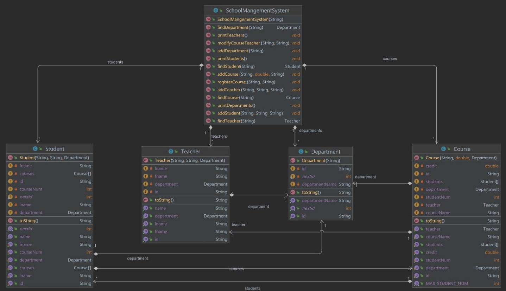

# SchoolManagementSystem
A school management system that contains departments, classes, teachers and students, 
with their own individual IDs and max amounts.

Final project for Introduction to Programming (420-201-RE sec.00002)
Using object-oriented-programming and all the knowledge points that have been covered in the course.

Features : 
- The IDs of each class formatted by the first letter of the class and three digits, and automatically increases;
- The system can assign one teacher to a class and print a message if not possible;
- The system can register students to classes (max 5), and each class can have max 5 students;
- The system can create new objects (departments, teachers, classes, students) and display the non-null ones;
- The system can search any of the objects by using the IDs, and return null if there are no matches.

